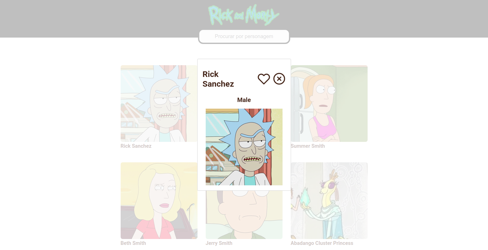

<br/>

# Projeto Rick & Morty

Esse projeto consiste em uma unica página onde é possivel visualizar
todos os personagens do famoso seriado Rick & Morty, nessa página é possivel
clickar no personagem para obter mais informações alem de favoritar e desfavoritar.
Por fim é possível ver seus personagens favoritados

Obs.: A pagina está responsiva (Mobile first)

<br/>

## Executanto Localmente

Faça o clone do Projeto

```bash
  git clone https://github.com/jairosl/rick-morty-next my-project
```

Vá para o diretório do projeto

```bash
  cd my-project
```

Intale as Dependências

```bash
  npm install
```

ou

```bash
  yarn
```

Execute o comando

```bash
  npm run dev
```

ou

```bash
  yarn dev
```

<br/>

## Tecnologias usadas e Features

- Context api
- Resposividade
- React hooks
- Lottie
- Eslint
- Prettier
- Git Commitizen
- Typescript
- Axios
- Styled Component

<br/>

## Screenshots





<br/>

